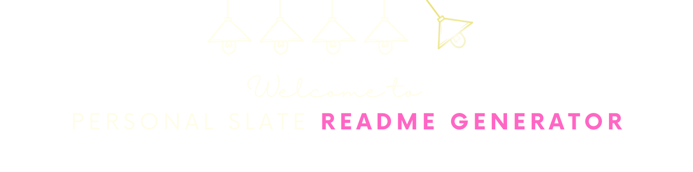
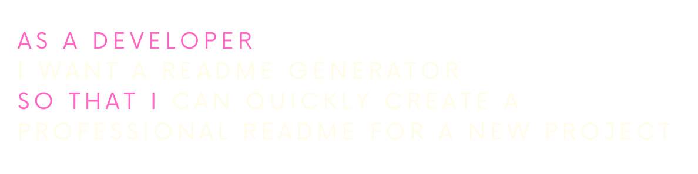
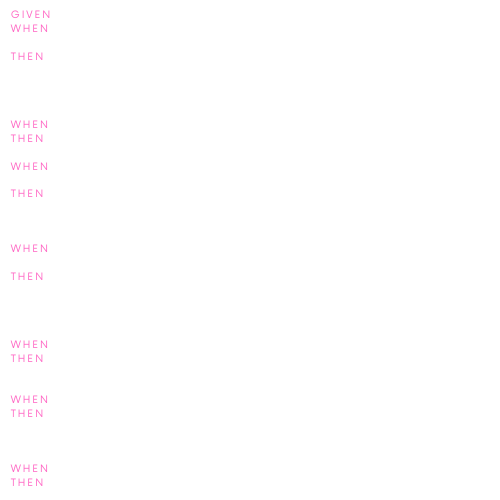
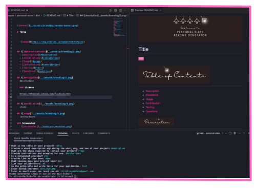

# Professional README Generator

## 

  - [OVERVIEW](#description)
    - [user story](#user-story)
    - [acceptance criteria](#acceptance-criteria)
    - [to-do list](#to-do-list)
  - [INSTALLATION](#installation)
  - [USAGE](#usage)
    - [screenshot](#screenshot)
    - [demo](#demo)
  - [SOURCES](#sources)
  - [LICENSE](#license)
  - [LINKS](#links)
  - [CONNECT](#connect)
 

## 

Create a command-line application that dynamically generates a professional **README.md** file from a user's input using the [Inquirer package]((https://www.npmjs.com/package/inquirer/v/8.2.4)).

### 

### 

## 

The application was invoked using the following commands: 
- node index.js
- npm i -y
- npm i inquirer@8.2.4 --start -dev

## 

### 

The below screenshot demonstrates the command-line application and the resulting sample README.md that is produced.

### 

## 
Here's a list of technologies used:

1. [Inquirer]((https://www.npmjs.com/package/inquirer/v/8.2.4)) - the NPM package that provides an easy way to capture user input in your Node. js command line interface applications. 

2. [Professional README Guide](https://coding-boot-camp.github.io/full-stack/github/professional-readme-guide) - a reminder of everything that a high-quality, professional README should contain.

3. [Node.js]() - is an open-source, cross-platform JavaScript runtime environment.

4. [Fullstack Blog Video Submission Guide](https://coding-boot-camp.github.io/full-stack/computer-literacy/video-submission-guide) - for additional guidance on creating a video.

## 

## 

[GitHub Repository](https://github.com/christiecamp/personal-slate)

[Sample README](./dist/sample.md)

[Video Walkthrough](https://nodejs.org/en/about)

## 
   Questions? Connect with me at: 
   GiHub: [christiecamp](https://github.com/christiecamp) 
   Email: christiecamphoto@gmail.com 
   

