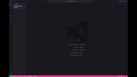
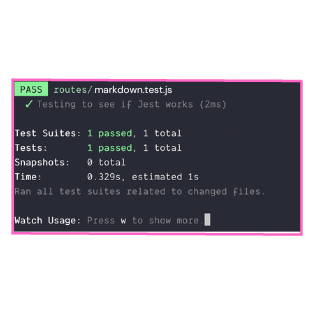

  

# The Personal Slate README Generator

  

  

## 
  - [Description](#description)
  - [Installation](#installation)
  - [Usage](#usage)
  - [Contribution](#contribution)
  - [Testing](#testing)
  - [Connect](#connect)

## 
  The Personal Slate README Generator creates a README file by using command-line applications to generate one
 
### 

https://choosealicense.com/licenses/mit
  
  
  
## 
  1. node i -y

## 
  1. Initiate the terminal and type node index
  
### 

  
  
### 

    

## 
  Christine Campbell

  
## 

    

## 
   Questions? Connect with me at: 
   GiHub: [christiecamp](https://github.com/christiecamp) 
   Email: christiecamphoto@gmail.com! 
   
